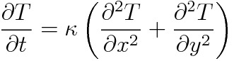

# Heat-Control-Simulation
This program is a 2D heat control simulator based on boundary control of heat difffusion equation.

## Simulation Flow
1. Space discretization of heat difffusion equation
2. Set matrices of servo system
3. Design feedback matrix by LQR method
4. Solve ODE
5. Visualization

## License
MIT License